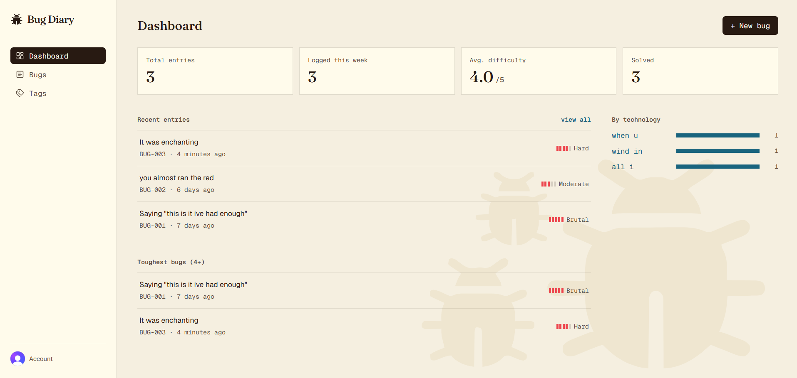
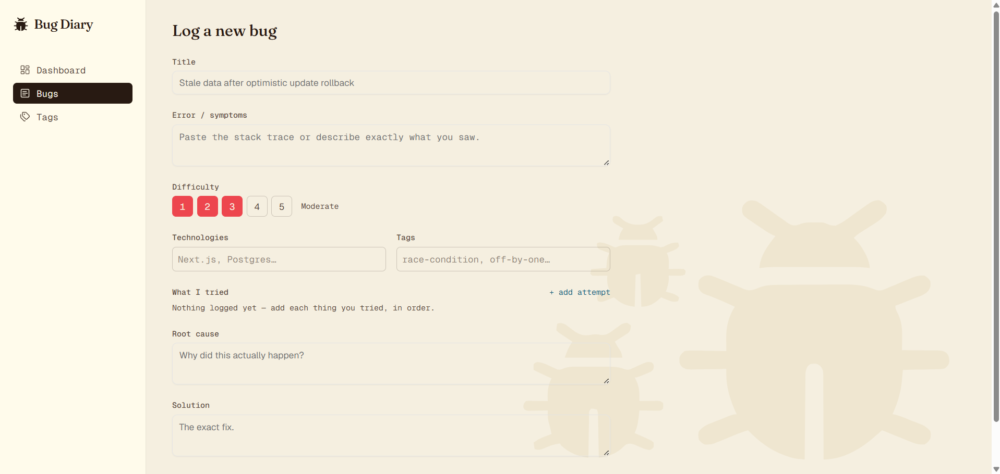
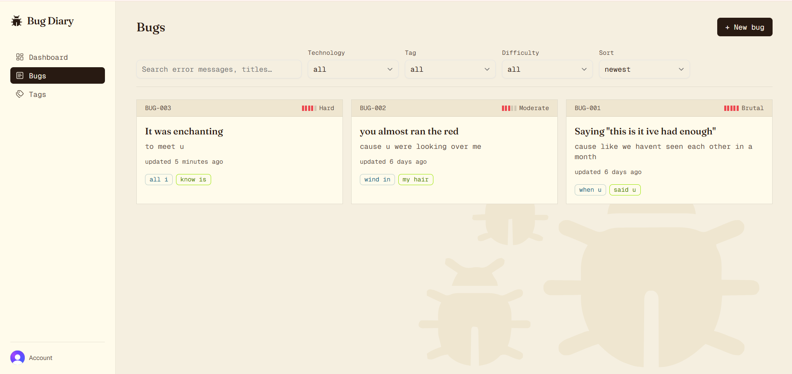
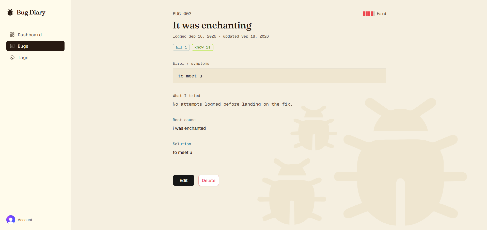
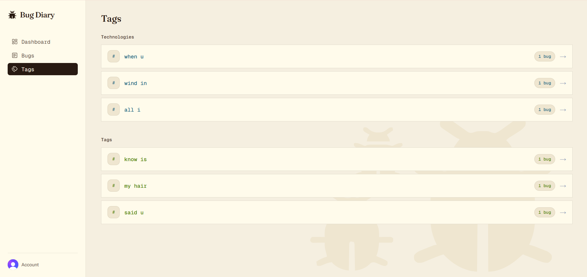

# 🐛 Bug Diary

A personal debugging log built with Next.js - record what broke, what you tried, what actually caused it, and what fixed it, so six months later you find the answer instead of relearning it.

## 🚀 Features

- Log bugs with error/symptoms, root cause, and solution
- Track every attempt you made in order, including dead ends, and mark which one worked
- Rate each bug's difficulty (1-5) to see what actually cost you time
- Tag entries and group them by tag or technology
- Dashboard with total entries, entries this week, average difficulty, solved count, and a technology breakdown
- Every entry is private to the signed-in user

## 🛠 Tech Stack

**Frontend**
- Next.js (App Router)
- TypeScript
- TailwindCSS
- shadcn/ui
- Motion (animations)

**Backend**
- Next.js Server Actions
- Drizzle ORM
- Neon (Postgres)
- Zod (validation)

**Auth**
- Clerk

## 📸 Screenshots

### Dashboard


### New Bug Form


### Bug List


### Bug Entry


### Tags Page


## 🧰 Getting Started

**Prerequisites:** Node.js 18+, a [Neon](https://neon.tech) database, and a [Clerk](https://clerk.com) application (both have free tiers).

**1. Clone and install**
```bash
git clone https://github.com/Asmi100804/Bug_Diary.git
cd Bug_Diary
npm install
```

**2. Set up environment variables**

Copy `.env.example` to `.env` and fill in:
```bash
DATABASE_URL=
NEXT_PUBLIC_CLERK_PUBLISHABLE_KEY=
CLERK_SECRET_KEY=
```
Clerk keys are under **API Keys** in your Clerk dashboard. The database URL is under **Connection Details** in Neon.

**3. Set up the database**
```bash
npx drizzle-kit generate
npx drizzle-kit migrate
```

**4. Run it**
```bash
npm run dev
```
Open [http://localhost:3000](http://localhost:3000), sign up, and log your first bug.
